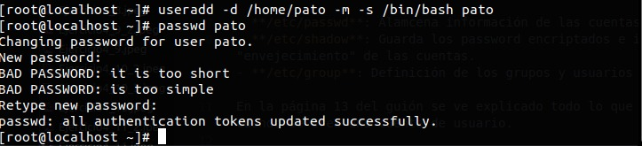
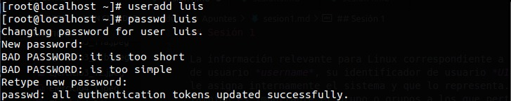
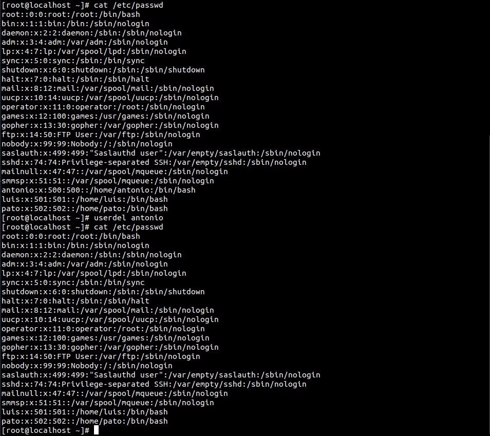
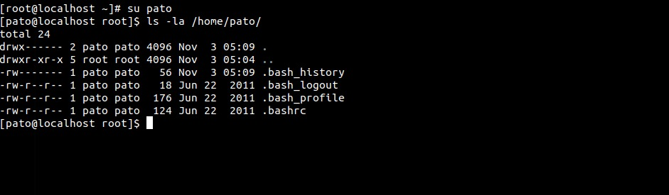
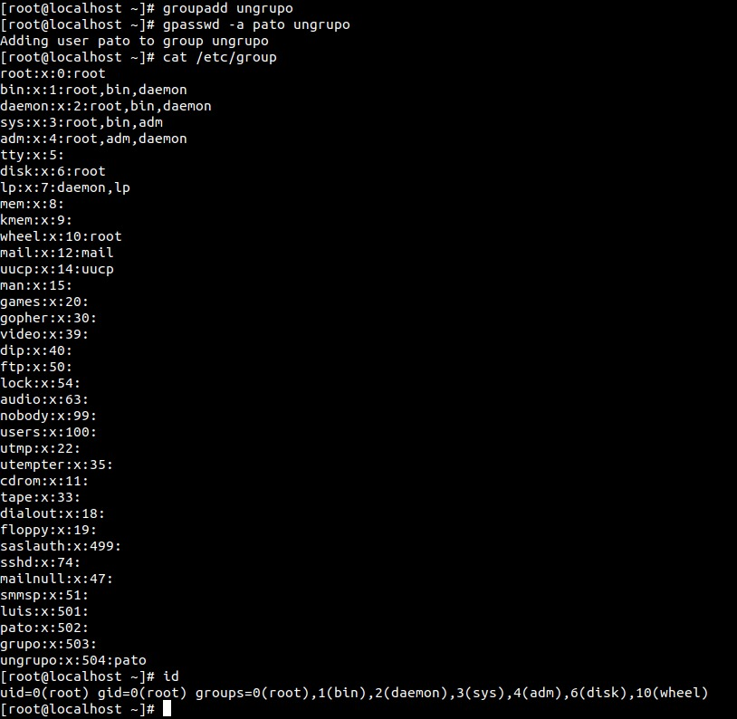
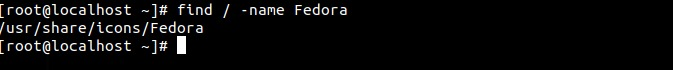

## Sesión 1

La información relevante para Linux correspondiente a un usuario es su nombre de usuario *username*, su identificador de usuario *UID* que es un entero que le asigna internamente el sistema y que lo representa. El UID de root es 0. También es importante el grupo o grupos a los que pertenece. Un usuario tiene asignado un grupo principal, que es el que aparece especificado en /etc/passwd, aunque también puede pertenecer a otros grupos suplementarios (se puede ver en /etc/group). El GID del superusuario es 0.

Hay una serie de archivos que son muy importantes, en los cuales podemos encontrar una serie de información que puede ser muy útil.

- **/etc/passwd**: Alamcena información de las cuentas de usuarios.
- **/etc/shadow**: Guarda los password encriptados e información de "envejecimiento" de las cuentas.
- **/etc/group**: Definición de los grupos y usuarios miembros.

En la página 13 del guión se ve explicado todo lo que se hace internamente cuando se crea una cuenta de usuario.

Para crear un usuario utilizamos las órdenes **useradd** ó **adduser**, estas ordenes toman los valores por defecto que se van a asignar a las cuentas de usuario a partir de la información especificada en los archivos ***/etc/default/useradd** y **/etc/login.defs**

Algunas órdenes para gestionar cuentas de usuario son:

- **usermod**: modifica una cuenta de usuario ya existente.
- **userdel**: elimina una cuenta de usuario (por defecto no borra el directorio home)
- **newusers**: Crea cuentas de usuarios utilando la información introducida en un archivo de texto , que ha de tener el formato del archivo /etc/passwd.
- **system-config-users**: herramienta en modo gráfico.

Algunos archivos de configuración para el shell Bash son: **.bash_profile,       .bashrc, .bash_logout**

**Actividad 1.3**

Con el comando passwd podemos asignar una contraseña a un usuario creado con useradd.

a) Creamos un par de usuario con distintas opciones.

b) Eliminamos un usuario y vemos que se eliminan los datos de /etc/passwd (también de group), por defecto el directorio home no se borra.

c) Entramos como el usuario pato y vemos los archivos que tiene en su directorio home.

**Actividad 1.5**

Solo el usuario root puede visualizar y modificar dicho fichero.

**Actividad 1.6**

Creamos un grupo, asignamos a pato a ese grupo y comprobamos el fichero /etc/group. La orden id te devuelve los uid y gid a los que pertenece el usuario logueado. 

**Actividad 1.7**

**Actividad 1.9**

fstab es una lista de dispositivos que se pueden montar en el arranque
mtab es una lista de dispositivos montados actualmente.