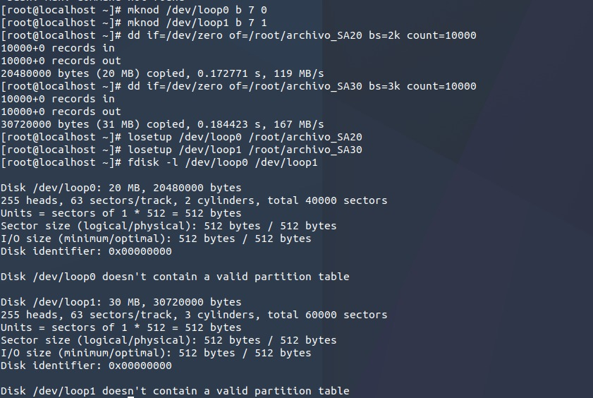
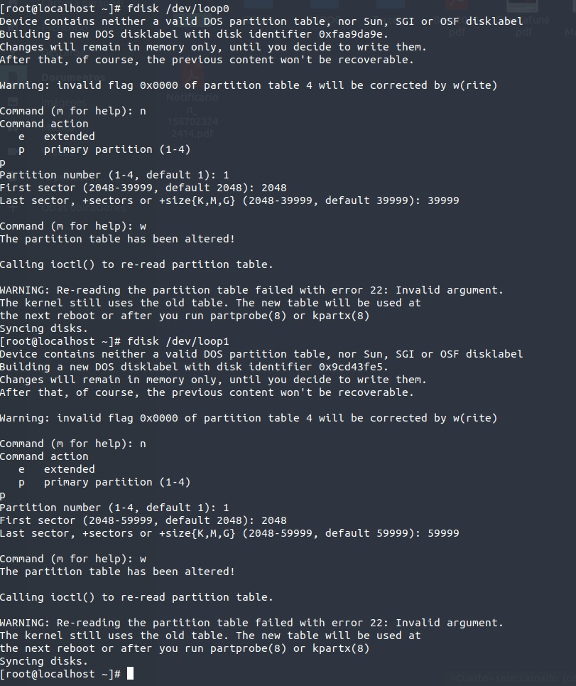
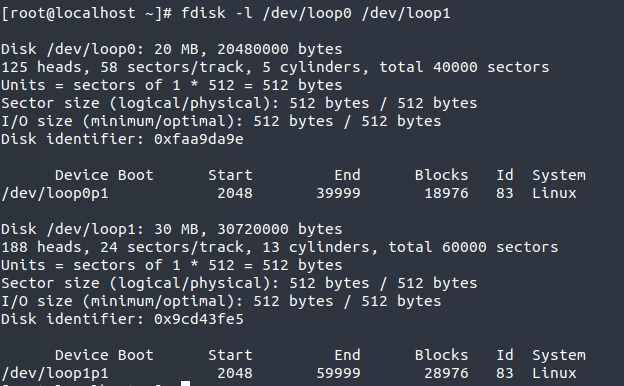
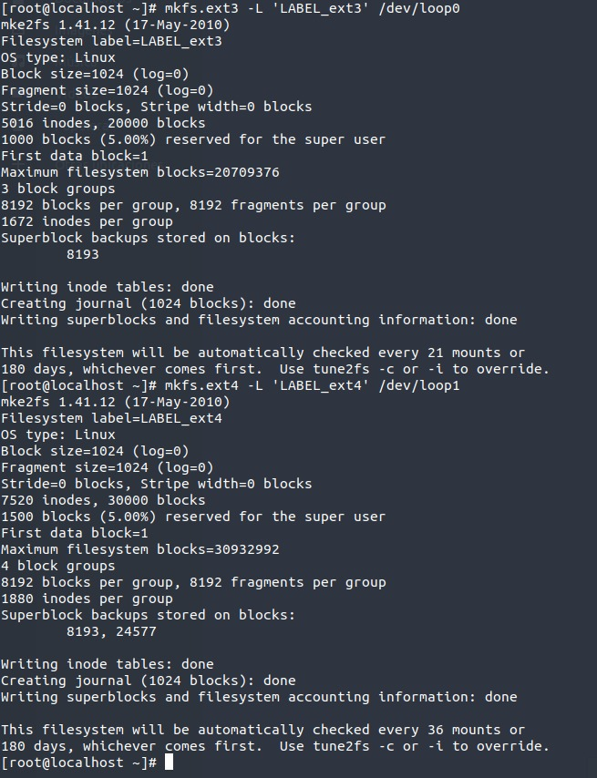
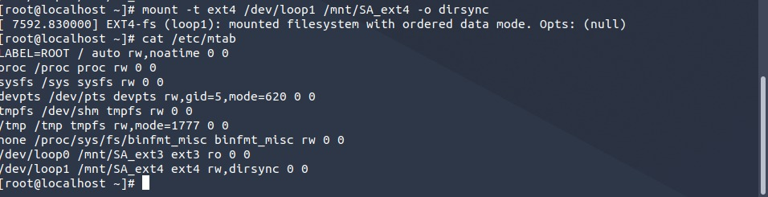
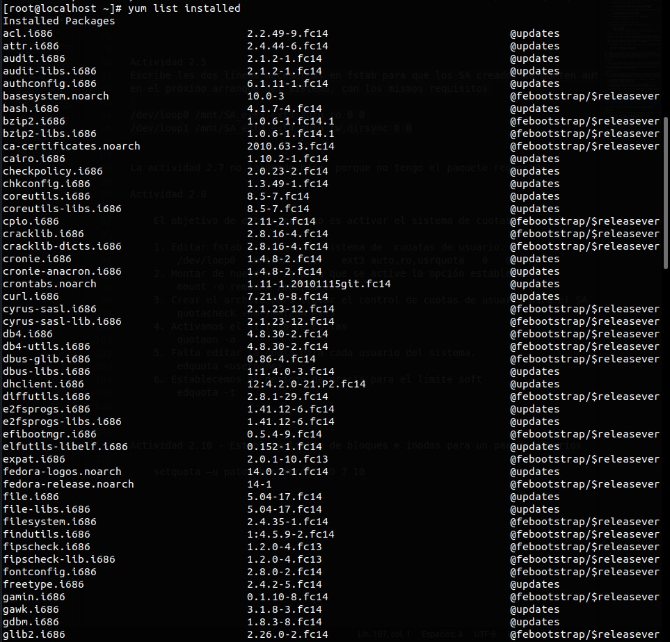

## Sesión 2

Cuando particionamos un dispositivo es necesario asociar a cada partición una etiqueta que indica que tipo de SA va a alojar posteriormente cuando se formatee.
Para ver el listado con las etiquetas soportadas por el sistema usamos /sbin/sfdisk -T

### Actividad 1

    A) Preparación previa a la partición de un dispositivo simulado mediante un archivo especial de dispositivo.
        Vamos a utilizar un dispositivo simulado mediante un archivo /dev/loop?

        1. Creo los archivos /dev/loop0 y /dev/loop1 con mknod

            mknod /dev/loop0 b 7 0
            mknod /dev/loop1 b 7 1

            El argumento b corresponde a que se va a crear un fichero especial de bloques (con búfer)

        2. Creamos un archivo de 20MB y otro de 30MB 

            dd if=/dev/zero of=/root/archivo_SA20 bs=2k count=10000
            dd if=/dev/zero of=/root/archivo_SA30 bs=3k count=10000

        3. Ahora asociamos un archivo de dispositivo loop a cada uno de los archivos creados

            losetup /dev/loop0 /root/archivo_SA20
            losetup /dev/loop1 /root/archivo_SA30

        4. Comprobamos la configuración de los discos virtuales

            fdisk -l /dev/loop0 /dev/loop1

        5. Finalmente solo hay que crear la tabla de particiones

            fdisk /dev/loop0
            fdisk /dev/loop1
            Se abré un proceso interactivo, con n se crea una partición, con w se sale

### Actividad 2

En este ejercicio vamos a formatear lógicamente las particiones creadas con anterioridad de forma que quede 
en cada una los sistemas de archivos que queremos (en una ext3 y en otra ext4).

Para esto vamos a utilizar la orden mke2fs. Como requisito es necesario que establezcamos 2 etiquetas de volumen.
LABEL_ext3 para la primera y LABEL_ext4 para la segunda.

El resultado de la ejecución de esta orden(mke2fs) es el formateo lógico de la partición escogida utilizando el SA que se ha seleccionado

    mkfs.ext3 -L 'LABEL_ext3' /dev/loop0
    mkfs.ext4 -L 'LABEL_ext4' /dev/loop1

Para ajustar algunos parámetros del sistema de archivos utilizamos tune2fs
Para realizar comprobaciones y reparar posibles inconsistencias usamos la herramienta fsck 
fsck actua sobre las estructuras de metainformación del SA, no sobre el contenido de los archivos
En la página 33 del guión aparecen ejemplos de inconsistencias.

### Actividad 3

a) ¿Cómo podrías conseguir que en el siguiente arranque del sistema se ejecutara automaticamente e2fsck sin que se haya alcanzado el máximo nº de montajes ?
- Con el modificador –C y un poniéndole un número más grande de veces que el sistema de archivos es montado que max-mount-counts.

b) ¿Cómo podrías conseguir reservar para uso exclusivo de un usuario username un número de bloques del sistema de archivos?
- tune2fs /dev/loop0–r [numero] –u username

### Actividad 4

Monta los Sistemas de archivos creados de forma que se cumplan los siguientes requisitos:
- El SA etiquetado como LABEL_ext3 debe estar montado en el directorio /mnt/SA_ext3 en modo solo lectura
- El SA etiquetado como LABEL_ext4 debe estar montado en el directorio /mnt/SA_ext4 y debe tener sincronizadas sus operaciones de E/S

Primero creamos los directorios que actuarán como puntos de montajes

    [root@localhost ~]# mkdir /mnt/SA_ext3
    [root@localhost ~]# mkdir /mnt/SA_ext4

    a) [root@localhost ~]# mount -t ext3 /dev/loop0 /mnt/SA_ext3 -o ro
    b) [root@localhost ~]# mount -t ext4 /dev/loop1 /mnt/SA_ext4 -o dirsync

Para comprobar que se han montado correctamente, con las opciones que queríamos comprobamos el fichero /etc/mtab

### Actividad 5

Escribe las dos líneas necesarias en fstab para que los SA creados se monten automaticamente
en el próximo arranque del sistema, con los mismos requisitos

/dev/loop0 /mnt/SA_ext3 ext3 auto ro 0 0
/dev/loop1 /mnt/SA_ext4 ext4 auto rw,dirsync 0 0

### Actividad 7

    yum list installed

Primero vamos a montar el Sistema de Archivos que se ubica en el sistema anfitrión.

    mount none /mnt -t hostfs -o /home/migue/Documentos/Cuarto/SO/Practicas/Modulo_I/paquetes

Ahora instalamos el paquete con el demonio atd

    rpm -i /mnt/at-3.1.12-5.fc14.i686.rpm

### Actividad 8

    El objetivo de este ejercicio es activar el sistema de cuotas sobre el sistema de archivos tipo ext3

    1. Editar fstab y activar el sistema de  cuoatas de usuario.
        /dev/loop0	/mnt/SA_ext3	ext3 auto,ro,usrquota	0	0
    2. Montar de nuevo el SA para que se active la opción establecida
        mount -o remount /mnt/SA_ext3
    3. Crear el archivo para llevar el control de cuotas de usuario para el SA
        quotacheck -nm /mnt/SA_ext3
    4. Activamos el sistema de cuotas 
        quotaon -a 
    5. Falta editar la cuota para cada usuario del sistema.
        edquota <username>
    6. Establecemos el periodo de gracia para el límite soft
        edquota -t

### Actividad 10

Establece límite de bloques e inodos para un par de usuarios

    setquota –u pato –b nombre 7 10 7 10    