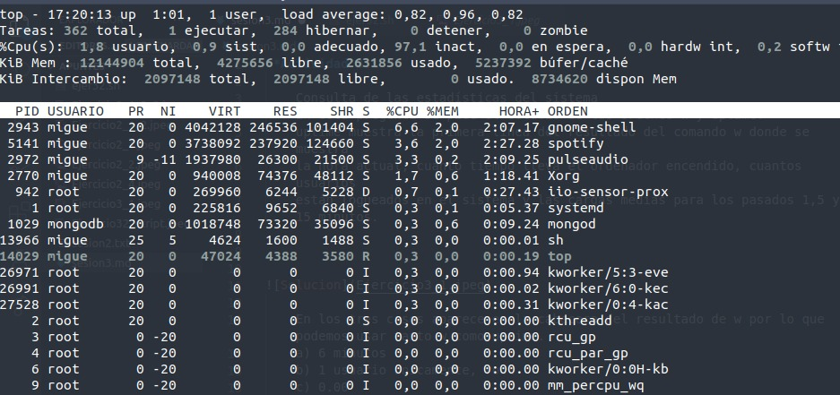
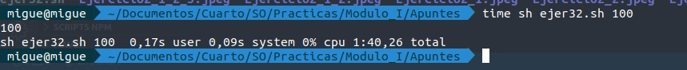

**Actividad 3.1** 

    Consulta de las estadísticas del sistema
    En esta pregunta se pide el estudio de las ordenes w y uptime.
    uptime muestra la primera línea del resultado del comando w donde se muestra
    la hora actual, cuanto tiempo lleva el ordenador encendido, cuantos usuarios 
    están logueados en el sistema y las cargas medias para los pasados 1,5 y 15 minutos.

    En los tres casos aparece en la cabecera del resultado de w por lo que podemos usar tanto w como uptime.
    a) 6 minutos
    b) 1 usuario únicamente, root
    c) 0.00

**Actividad 3.2**

    b)
    En la línea cuya orden es sh tenemos el proceso que corresponde al script bash lanzado, vemos que se le asigna una prioridad de 25

    En cuanto a la reasignación de prioridades, renice ha funcionado correctamente con la sintaxis de los ejemplos, renice 14 idProceso. No he conseguido hacer funcionar nice.

c)

**Actividad 3.3**

b)

    Los procesos cuyo PPID es ? significa que no tienen asignado ningún terminal en concreto.

**Actividad 3.4**

    a) Se usa mpsat
    b) Se usa mpsat
    c) Se usa top

Un dato a tener en cuenta es que free utiliza menos recursos que top.

**Actividad 3.5**

**Actividad 3.7**

**Actividad 3.8**

**Actividad 3.9**

    a) 
        du /

        du -h /

    b)
        df -i /

    c)
        du -h /<nombredirectorio>

    
    d)
        du -B 4 /etc

**Actividad 3.10**

    a) ln -s archivo.txt ./softlink
    b) ln archivo.txt hardlink
    c) ln target_hardLink2.txt hardlink2

    Porque los enlaces blandos no cuentan para el contador, solo los duros

**Actividad 3.11**

    a) ls -laiL

    b) ls -laid

**Actividad 3.12**

