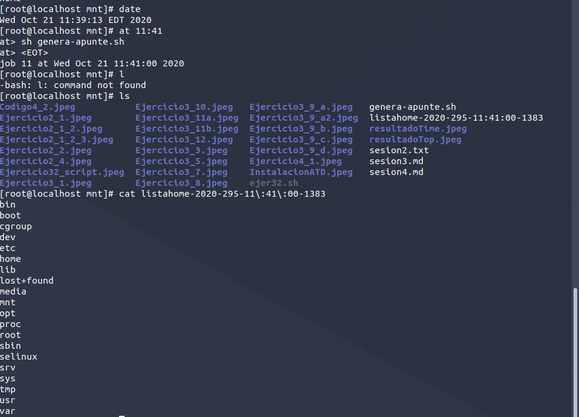

El demonio atd proporciona el servicio de ejecución postergada de órdenes, mientras que el demonio cron proporciona el servicio de ejecución periódica de órdenes.

Un demonio tiene las siguientes características:

   - Se ejecuta en background y no está asociado a un terminal o proceso login.
   - Muchos se ejecutan al inicio del SO y continúan ejecutandose mientras el sistema esté encendido. Otros se ponen en marcha cuando sea necesario y se detendrán cuando dejen de serlo.
   - En caso de que termine por un imprevisto, suelen existir mecanismos que detectan la terminación y lo vuelven a lanzar.
   - En muchos casos está a la espera de un suceso (puede ser un servidor).
   - En algunos cosas tiene encomendada la misión de hacer una tarea ya sea de forma periódica o siempre que se cumpla una condición.
   - Es muy frecuente que no realice la tarea directamente si no que lance a otros procesos que la realicen.
   - Los demonios son programas y no partes del kernel.
   - En muchos casos se ejecutan con privilegio de superusuario (UID=0) y tienen como padre el proceso init(PID=1).

### Actividad 1

Primero vamos a montar el Sistema de Archivos que se ubica en el sistema anfitrión.

- mount none /mnt -t hostfs -o /home/migue/Documentos/Cuarto/SO/Practicas/Modulo_I/paquetes

Ahora instalamos el paquete con el demonio atd

- rpm -i /mnt/at-3.1.12-5.fc14.i686.rpm

Lanzamos el demonio

- service atd start

Con ps -aux | grep "nombre demonio" sacamos el PID y con ps -p "Nº PID" -f obtenemos información un poco más detallada.

### Actividad 2

### Actividad 3

   - at -f ./genera-apunte.sh midnight
   - at -f ./genera-apunte.sh midnight+1 minute
   - at -f ./genera-apunte.sh 17:30 tomorrow
   - at -f ./genera-apunte.sh Dec 25 2013
   - at -f ./genera-apunte.sh midnight Jan 01 2013

### Actividad 4

   1. El proceso que se lanza hereda el directorio de trabajo del padre.
   2. La máscara que tiene es 0022, se hereda
   3. El entorno también se mantiene desde el momento de la invocación, excepto las variables BASH_VERSINFO, DISPLAY, EUID,GROUPS, SHELLOPTS, TERM, UID

### Actividad 5

   El script escrito es el siguiente

   

   Lo hemos lanzado de la siguiente manera 

   

   El resultado es el siguiente

   

   Como vemos el PID del script es 1399 que hereda de 1397 que es sh que hereda de atd.

### Actividad 6

   El código escrito es:

   

   Lo hemos lanzado de la siguiente manera 

   

### Actividad 8

   El código escrito es:

   

   El resultado lo comprobamos con atq

   

### Actividad 9

Destacar que si no dejamos una linea en blanco al final del archivo crontab, no podremos instalarlo en la cola de trabajos.

El archivo crontab especificado es el siguiente

Lo he lanzado así

Con crontab -l podemos ver los trabajos instalados en el cron

### Actividad 10
El código del script es el siguiente

He modificado el contenido del crontab del ejercicio anterior de manera que queda esto:

El resultado de la ejecución es el siguiente:

### Actividad 11

El script escrito es el siguiente:

Lo hemos vuelto a lanzar con un crontab y el resultado tras probarlo es el siguiente

El script escrito es el siguiente:

