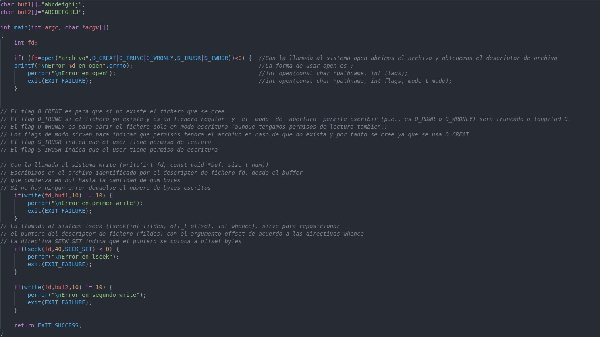
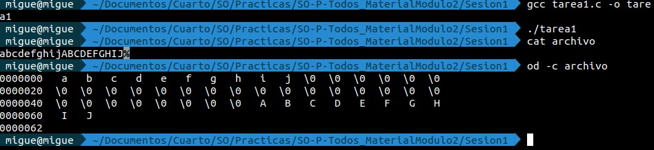
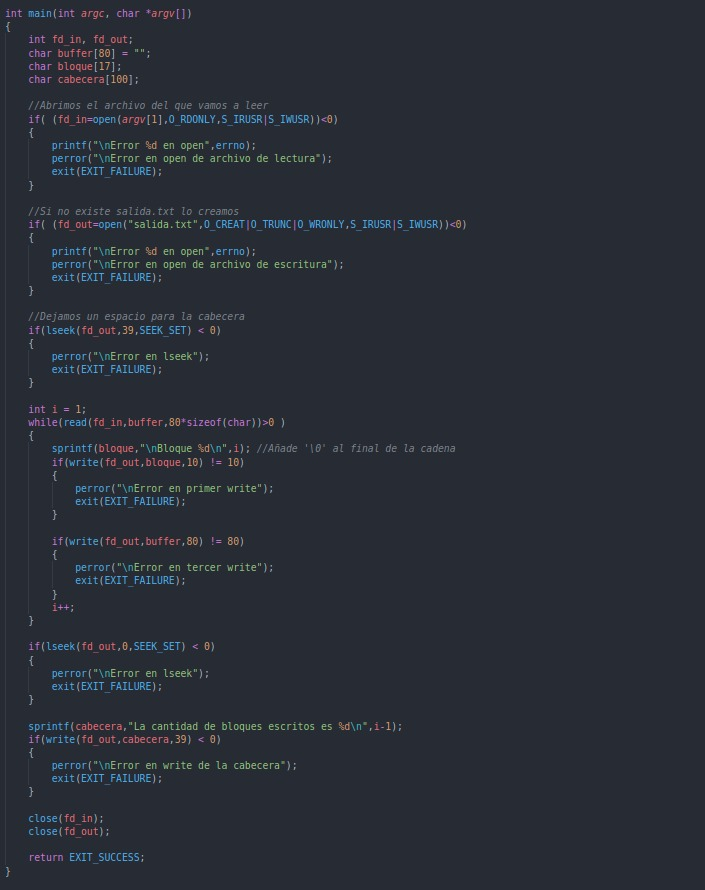
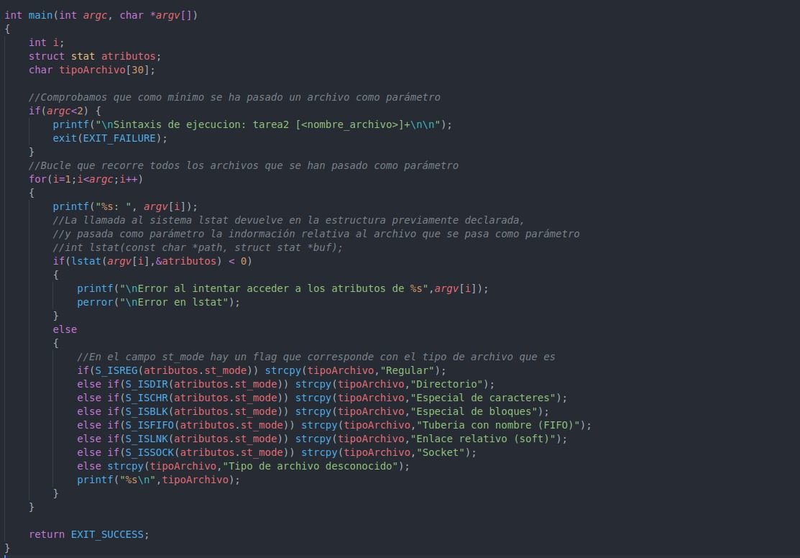
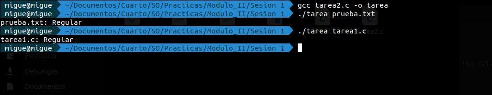
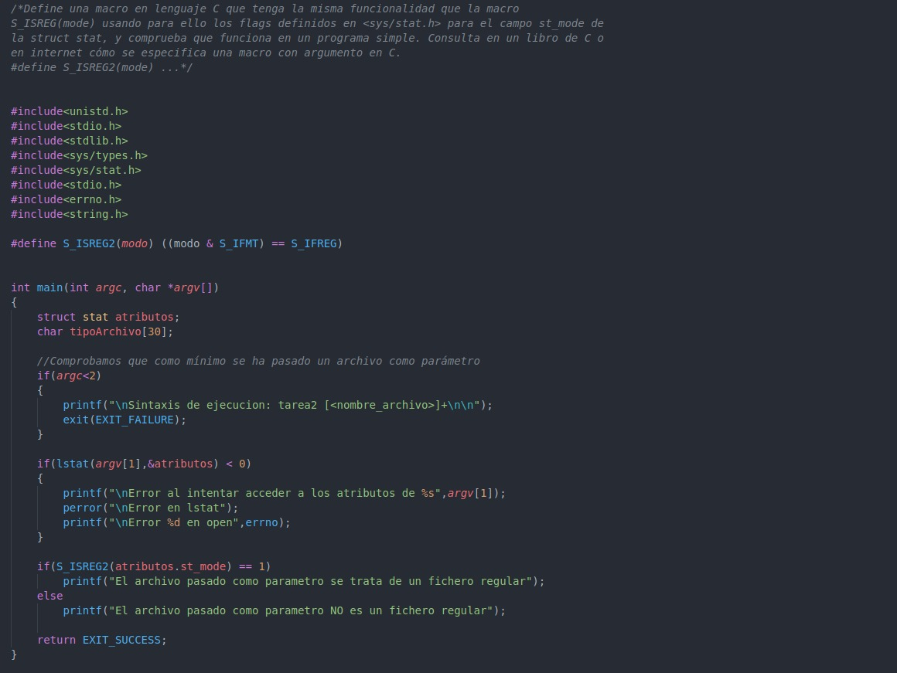
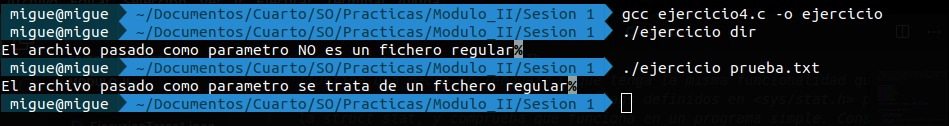

## Sesión 1
### Actividad 1

Se pide que se comente lo que realiza el programa tarea1.c
A continuación voy a dejar una imagen del código comentado con toda la información relativa a las llamadas al sistema utilizadas.

En primer lugar se abre el archivo de nombre "archivo" localizado en el directorio en el que se ejecuta el programa, en caso de que exista lo trunca (se elimina el contenido) y lo abre únicamente en modo escritura. En caso de que no exista, lo crea con permisos de lectura y escritura para el usuario que está ejecutando el programa.

Después, a través de la llamada al sistema write, escribimos en el archivo 10 caracteres contenidos en el buffer de nombre buf1. Se sigue con la llamada al sistema lseek para reposicionar el puntero de descriptor de fichero 40 Bytes, lo que hace que se dejen 40 Bytes con '\0' que son lo que vemos al hacer od -c archivo. Finalmente se escriben otros 10 elementos del buffer llamado buf2.

### Actividad 2

Para la resolución de esta actividad se ha implementado el siguiente código.

### Actividad 3

Se pide que se comente lo que realiza el programa tarea2.c
A continuación voy a dejar una imagen del código comentado con toda la información relativa a las llamadas al sistema utilizadas.

El programa básicamente, lee una serie de ficheros como parámetro, usa la llamada al sistema lstat para llenar la estructura de datos stat y comprueba mediante una serie de funciones el campo st_mode para obtener de que tipo de archivo se trata. En este puedes encontrar toda la información necesaria sobre esta llamada al sistema (http://manpages.ubuntu.com/manpages/bionic/es/man2/stat.2.html)

### Actividad 4

Para la resolución de esta actividad se ha implementado el siguiente código.

