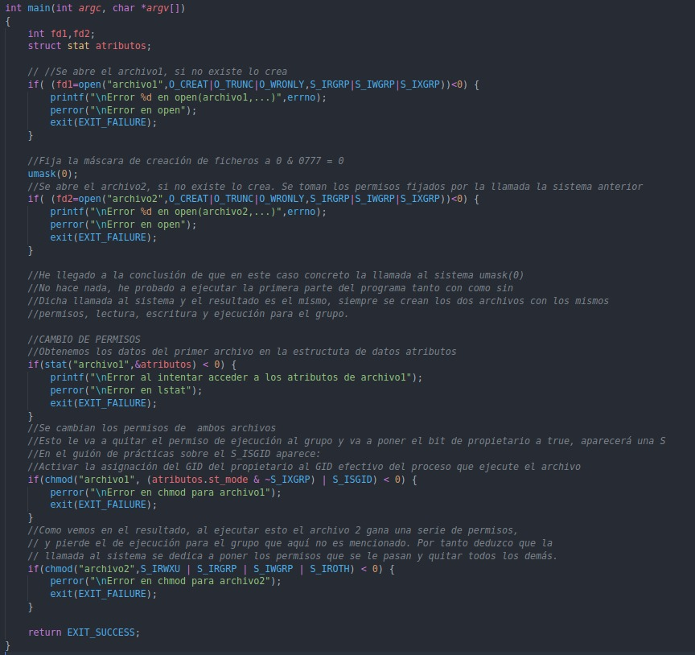

## Sesión 2

Esta sesión trata las llamadas al sistema relacionadas con los permiso de los archivos, se verán **umask, chmod y fchmod** y también se verán llamadas al sistema para el manejo de directoros, concretamente vamos a usar las llamadas al sistema **opendir, readdir, closedir, seekdir, telldir, rewinndir** y la estructura de datos llamada **dirent**. Finalmente estudiarémos la llamada **nftw** para recorrer un sistema de archivos.

La llamada al sistema **umask**  establece la máscara de usuario a mask & 0777, establece la máscara de creación de ficheros.

- mode_t umask(mode_t mask);

La llamada al sistema **chmod** cambia los permisos de un archivo.

- int chmod(const char *path, mode_t mode);
- int fchmod(int fildes, mode_t mode);

### Actividad 1

Procedo a comentar la explicación sobre el propio código.

Esta es la ejecución el código propuesto, la primera tan solo la parte de la creación de los ficheros, vemos que la llamada al sistema umask(0) es este caso no influye. Y en el segundo caso vemos que si acaban con permisos distintos.

A continuación procedo a comentar un breve explicación de las llamadas al sistema para el manejo de directorios.

- **opendir**: Se le pasa el pathname del directorio a abrir , y devuelve un puntero a la estryctura de datos tipo DIR llamada stream de directorio.

    - DIR *opendir(char *dirname); 

- **readdir**: Lee la entrada donde esté situado el puntero de lectura de un directorio ya abierto cuyo stream se pasa a la función.

    - dirent *readdir(DIR *dirp);

- **closedir**: Cierra un directorio devolviendo 0 si tiene éxito y -1 en caso contrario.

    - int closedir(DIR *dirp);

- **seekdir**: Permite situar el puntero de lectura de un directorio (se debe convinar con **telldir**).

    - void seekdir(DIR *dirp, long loc);

- **telldir**: Devuelve la posición del puntero de lectura de un directorio.

    - long telldir(DIR *dirp);

- **rewinddir**: Posiciona el puntero de lectura al principio del directorio.

    void rewinddir(DIR *dirp);

    typedef struct _dirdesc {
        int dd_fd;
        long dd_loc;
        long dd_size;
        long dd_bbase;
        long dd_entno;
        long dd_bsize;
        char *dd_buf;
    } DIR;

La estructura struct dirent conforme a POSIX 2.1 es la siguiente:

    #include <sys/types.h>
    #include <dirent.h>
    struct dirent {
        long d_ino; /* número i-nodo */
        char d_name[256]; /* nombre del archivo */
    };

### Actividad 2

### Actividad 3

Como ya hemos visto es posible recorrer recursivamente un sistema de archivos con las llamadas al sistema que hemos estudiado, sin embargo hay una llamada al sistema que está implementada especialmente para facilitar esto al programador. Esta es la llamada al sistema nftw.

- **nftw**: Permite recorrer recursivamente un sub-árbol del sistema de archivos.

    - int nftw (const char *dirpath, int (*func) (const char *pathname, const struct stat *statbuf, int typeflag, struct FTW *ftwbuf), int nopenfd, int flags);

La función recorre el árbol de directorios especificado por dirpath y llama a la función func definida por el programador para cada archivo del árbol. Por defecto, ntfw realiza un recorrido no ordenado en preorden del árbol, procesando primero cada directorio antes de procesar los archivos y subdirectorios dentro del directorio.

### Actividad 4

