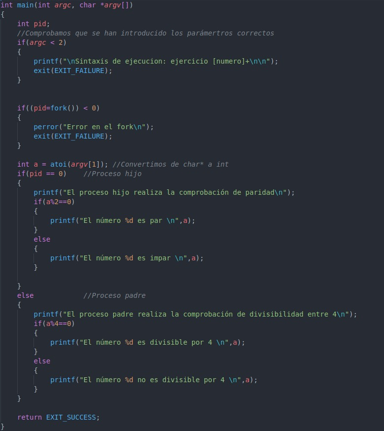
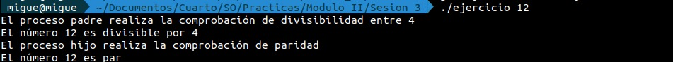
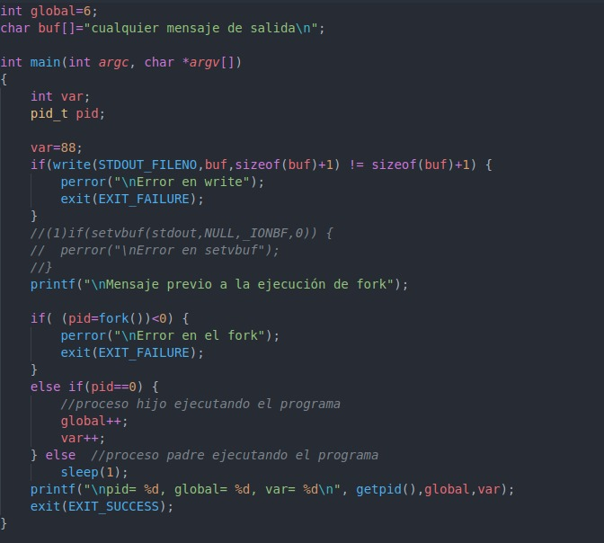
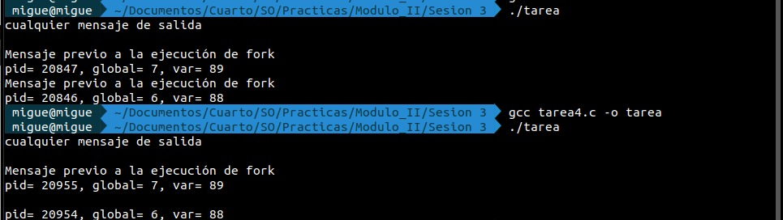
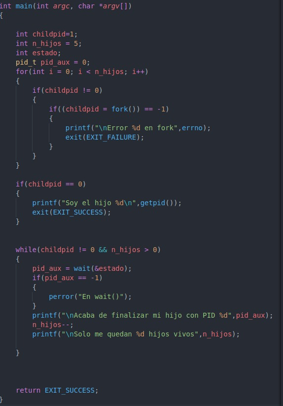
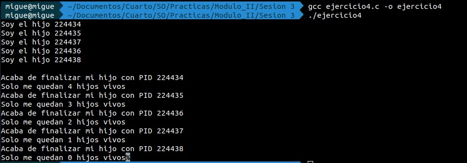
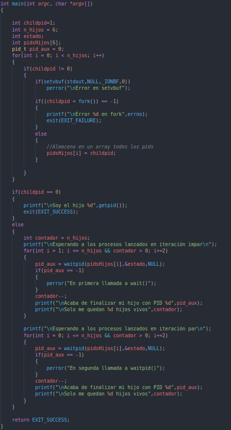
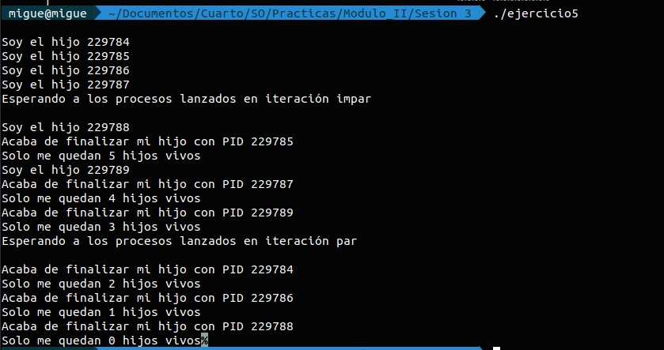

## Sesión 3

Esta sesión consiste en estudiar y practicar, las llamadas al sistema para el control de procesos.

Se empieza explicando que es un identificador de procesos, además se mencionan las siguientes llamadas al sistema para trabajar con dichos identificadores.

    #include <unistd.h>
    #include <sys/types.h>

    pid_t getpid(void); // devuelve el PID del proceso que la invoca.
    pid_t getppid(void); // devuelve el PID del proceso padre del proceso que la invoca.
    uid_t getuid(void); // devuelve el identificador de usuario real del proceso que la invoca.
    uid_t geteuid(void); // devuelve el identificador de usuario efectivo del proceso que la invoca.
    gid_t getgid(void); // devuelve el identificador de grupo real del proceso que la invoca.
    gid_t getegid(void); // devuelve el identificador de grupo efectivo del proceso que la invoca.

**Llamada al sistema fork**

    #include <sys/types.h>
    #include <unistd.h>

    pid_t fork(void);

fork  crea  un proceso hijo que difiere de su proceso padre sólo en su PID y PPID, y en el hecho de que el uso de recursos esté asignado a 0.  Los candados de fichero (file locks) y las señales pendientes no se heredan.

Valor devuelto:  En caso de éxito, se devuelve el PID del proceso hijo en el hilo de ejecución de su padre, y se devuelve un 0  en el hilo de ejecución del hijo. En caso de fallo, se devolverá un -1 en el contexto del padre, no se creará ningún proceso hijo, y se pondrá en errno un  valor apropiado.

Más información en : http://manpages.ubuntu.com/manpages/bionic/es/man2/fork.2.html

### Actividad 1

Es destacable comentar el uso de la función **atoi** para pasar de char *, tipo de dato de los argumentos del main a int.

### Actividad 2

La primera ejecución corresponde al código con el apartado (1) comentada, y la segunda sin comentar. 

Lo que ocurre en este ejercicio es que, a diferencia de las llamadas al sistema del núcleo (write) en las que no se realiza buffering (por lo que se escribe directamente en la salida),  mientras que en las llamada al sistema de la biblioteca de entrada y salida de C, si se realiza buffering, de manera que cuando se crea el proceso hijo con la orden fork, este hereda el buffer del padre, que contiene el mensaje "Mensaje previo a la ejecución del fork", de manera que cuando el hijo ejecuta el último printf añade a su buffer el nuevo mensaje y escribe ambos mensajes juntos. Para evitar esto se utiliza la llamada al sistema setvbuf, de manera que le decimos al padre que no utilice buffering y por tanto en la segunda ejecución el hijo no hereda el buffer del padre.

Algunas llamadas al sistema importantes son:

    #include <sys/types.h>
    #include <sys/wait.h>

    pid_t wait(int *status);
    pid_t waitpid(pid_t pid, int *status, int options);

La  función  wait  suspende  la  ejecución del proceso actual haste que un proceso hijo ha terminado, o hasta que se produce una señal cuya acción es terminar el  proceso  actual  o llamar  a  la  función  manejadora  de la señal. Si un hijo ha salido cuando se produce la llamada (lo que se entiende por proceso "zombie"), la función vuelve inmediatamente. Todos los recursos del sistema reservados por el hijo son liberados.

La  función  waitpid  suspende  la  ejecución  del  proceso  en  curso  hasta  que un hijo especificado por el argumento pid ha terminado, o hasta que  se  produce  una  señal  cuya acción es finalizar el proceso actual o llamar a la función manejadora de la señal.

Más información: http://manpages.ubuntu.com/manpages/bionic/es/man2/wait.2.html

    void _Exit(int status);

La  función  _exit termina "inmediatamente" la ejecución del proceso invocador.  Todos los descriptores de ficheros abiertos  que  pertenezcan  al  proceso  se  cierran todos  los procesos  hijos  son  heredados  por el proceso 1, init, y al proceso padre se le envía la señal SIGCHLD.

El valor status se le devuelve al proceso padre como estado de terminación del proceso,  y se puede leer mediante una de las funciones de la familia de wait.

### Actividad 4

### Actividad 5

