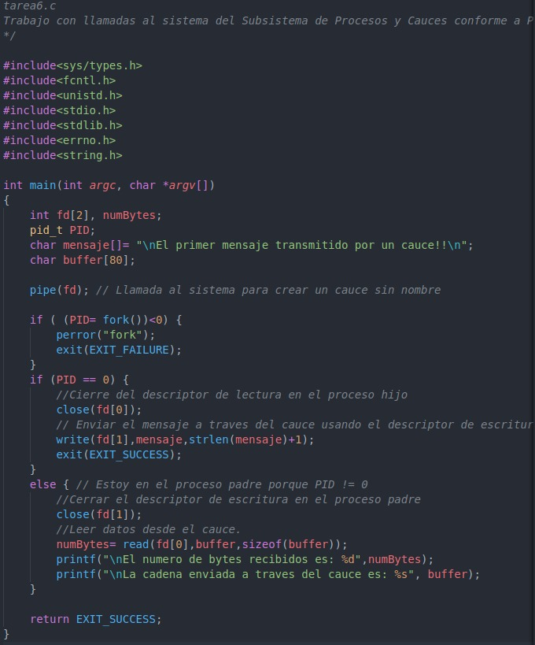
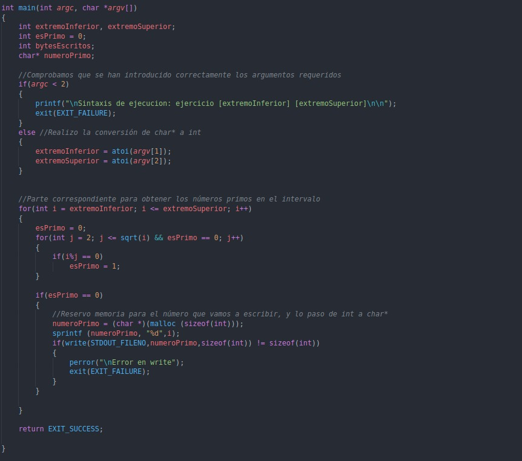

## Sesión 4

Durante esta sesión vamos a estudiar y practicar la comunicación de procesos utilizando cauces.

Un **cauce** es un mecanismo para la comunicación de información y sincronización entre procesos. Los datos pueden ser enviados(escritos) por varios procesos al cauce, y a su vez recibidos(leídos) por otros procesos desde dicho cauce.

La comunicación a través de un cauce sigue el paradigma de interacción productor/consumidor. Los datos se tratan en orden FIFO (First In First Out). **La lectura de los datos por parte de un proceso produce su eliminación del cauce.**

Los cauces proporcionan un método de comunicación entre procesos en un sólo sentido(unidireccional, semi-dúplex) es decir, si deseamos comunicar en el otro sentido es necesario utilizar otro cauce diferente.

Podemos diferenciar entre cauces sin nombre (ls | sort | lp) los datos fluyen entre los procesos, la salida del primero es la entrada del siguiente. Internamente el shell utiliza la llamada al sistema **pipe** .

Algunas de las características de los cauces sin nombre son:

- No tienen archivo creado en el sistema de archivos del disco.
- Al usar **pipe** se devuelve un descriptor de lectura y otro de escritura por lo que no es necesaria la llamada al sistema **open**.
- Estos cauces solo pueden ser utilizados entre el proceso que crea el cauce sin nombre y los descendientes creados a partir de la creación del cauce.
- El cauce sin nombre se cierra y elimina automáticamente por el núcleo cuando los contadores asociados a los números de productores y consumidores que lo tienen en uso valen simultáneamente 0.

Los cauces con nombre  presentan alguna característica diferencial.

- Se crean en el sistema de archivos en disco como un archivo especial. Llamadas al sistema **mknod** y **mkinfo**.
- Los archivos creados se abren y cierran con **open** y **close**.
- Para compartir datos con ellos utilizamos las llamadas al sistema **read** y **write**.
- El archivo FIFO permanece en el sistema de archivos una vez realizadas todas las E/S hasta que se borre explicitamente con la llamada al sistema **unlink**.

**Cauces con nombre**

Una vez el cauce con nombre esté creado cualquier proceso puede abrirlo para lectura y/o escritura. **El cauce debe estar abierto en ambos extremos simultáneamente antes de realizar operaciones con el**.

En C para crear un archivo FIFO utilizamos la llamada al sistema **mknod**

    #include <sys/types.h>
    #include <sys/stat.h>
    #include <fcntl.h>
    #include <unistd.h>

    int mknod(const char *pathname, mode_t mode, dev_t dev);

Para los archivos FIFO el mode debe ser **S_IFIFO** y el dev 0. Ejemplo 

    mknod("/tmp/FIFO",S_IFO|0666, 0);

Se puede consultar el siguiente enlace para más información sobre esta llamada al sistema: http://manpages.ubuntu.com/manpages/bionic/es/man2/mknod.2.html

Para los archivos fifo concretamente también existe la llamada al sistema **mkfifo**, más información aquí http://manpages.ubuntu.com/manpages/hirsute/en/man2/mkfifo.2freebsd.html

    int mkfifo (const char *FILENAME, mode_t MODE)

El campo MODE se utiliza para establecer los permisos del archivo.

Para eliminar un archivo FIFO se usa la llamada al sistema **unlink**, más información aquí: http://manpages.ubuntu.com/manpages/bionic/es/man2/unlink.2.html 

    int unlink(const char *pathname);

Las operaciones de E/S sobre los archivos fifo son las mismas que para los archivos regulares, salvando la diferencia de que no se puede usar **lseek**. Mover el offset contradice la filosofía FIFO.

- La llamda read es bloqueante para los consumidores cuando no hay datos que leer.
- read desbloquea devolviendo 0 cuando todos los procesos que actuaban como consumidores lo han cerrado o han terminado.

### Actividad 1

Consulte   en el manual las llamadas al sistema para la creación de archivos especiales en general (mknod) y la específica para archivos FIFO (mkfifo). Pruebe a ejecutar el siguiente código correspondiente a dos programas que modelan el problema del productor/consumidor, los cuales utilizan como mecanismo de comunicación un cauce FIFO. Determine en qué orden y manera se han de ejecutar los dos programas para su correcto funcionamiento y cómo queda reflejado en el sistema que estamos utilizando un cauce FIFO. Justifique la respuesta.

Si analizamos un poco el código vemos que el fichero de comunicación FIFO se crea en el consumidor que es el que realiza la llamada al sistema mknod. Como sabemos para que un proceso pueda hacer open de dicho archivo es necesaria la creación previa. Por tanto es necesario primero lanzar el consumidor que se quedará a la espera de que se lance el proceso productor para que el primero pueda consumir algún dato.

**Cauces sin nombre**

Como vemos en el diagrama, estos cauces son muy útiles para comunicar procesos por ejemplo un padre con un hijo.

Para crear un cauce sin nombre utilizamos la llamada al sistema **pipe** 

    int pipe(int descf[2]);

Esta nos devuelve en el vector de dos enteros que le pasamos como parámetro los dos descriptores de archivo, normalmente se usa descf[0] para lectura y descf[1] para escritura.

Al crear el proceso hijo, este hereda los descriptores del padre, es importante cerrar los extremos que no se vayan a usar (con la llamada al sistema **close**). De manera que si el padre quiere recibir datos envidados por el hijo debe cerrar el cauce usado para escritura (descf[1]) y el hijo el de lectura (descf[0]).

Más información sobre pipe en: http://manpages.ubuntu.com/manpages/bionic/es/man2/pipe.2.html

Para redireccionar la entrada o salida estándar al descriptor de lectura o escritura del cauce podemos hacer uso de las llamadas al sistema **close**, **dup** y **dup2**

    int dup(int oldfd);
    int dup2(int oldfd, int newfd);

La llamada al sistema **dup2** permite una atomicidad, evita posibles condiciones de carrera.

Más información aquí: http://manpages.ubuntu.com/manpages/bionic/es/man2/dup2.2.html

### Actividad 2

Consulte en el manual en línea la llamada al sistema pipe para la creación de cauces sin nombre. Pruebe a ejecutar el siguiente programa que utiliza un cauce sin nombre y describa la función que realiza. Justifique la respuesta.

En este ejercicio lo que ocurre es que, primero se crea un cauce sin nombre, para que al hacer fork el proceso hijo herede los descriptores del padre.

En el código del proceso hijo se cierra el descriptor de lectura, ya que el hijo sólo va a escribir. Finalmente mediante la llamada al sistema write escribimos el mensaje en el descriptor de escritura.

En el proceso padre cerramos el descriptor de escritura, ya que solo vamos a leer, y mediante una orden read, leemos del cauce. Finalmente se muestra por pantalla el mensaje leido.

### Actividad 3
Este ejercicio consiste en imitar ls | sort mediante la redirección de la entrada y salida estándar

### Actividad 4
Es igual que el ejercicio anterior, la salida es la misma, solo cambia la llamada al sistema dup por la llamada al sistema dup2

Para entender correctamente el funcionamiento de dup he leído esto: http://systemadmin.es/2010/05/como-funcionan-las-llamadas-al-sistema-dup-open-close

### Actividad 5

La imagen se ve muy pequeña, en la carpeta Sesión 4 se encuentran todos los códigos utilizados comentados adecuadamente.

En este ejercicio el principal problema que he encontrado ha sido al redireccionar la entrada y salida de los procesos para que los esclavos escriban en el pipe y el maestro lea del mismo

Es parte de la ejecución ya que no cabía en una imagen
