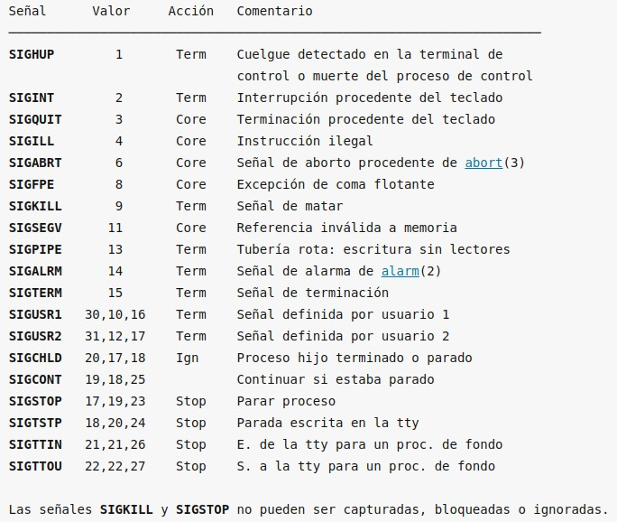
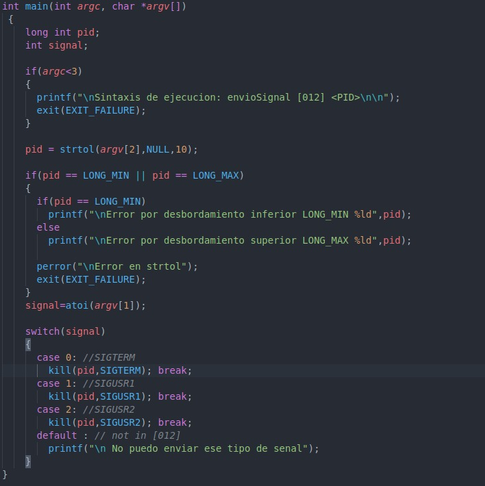
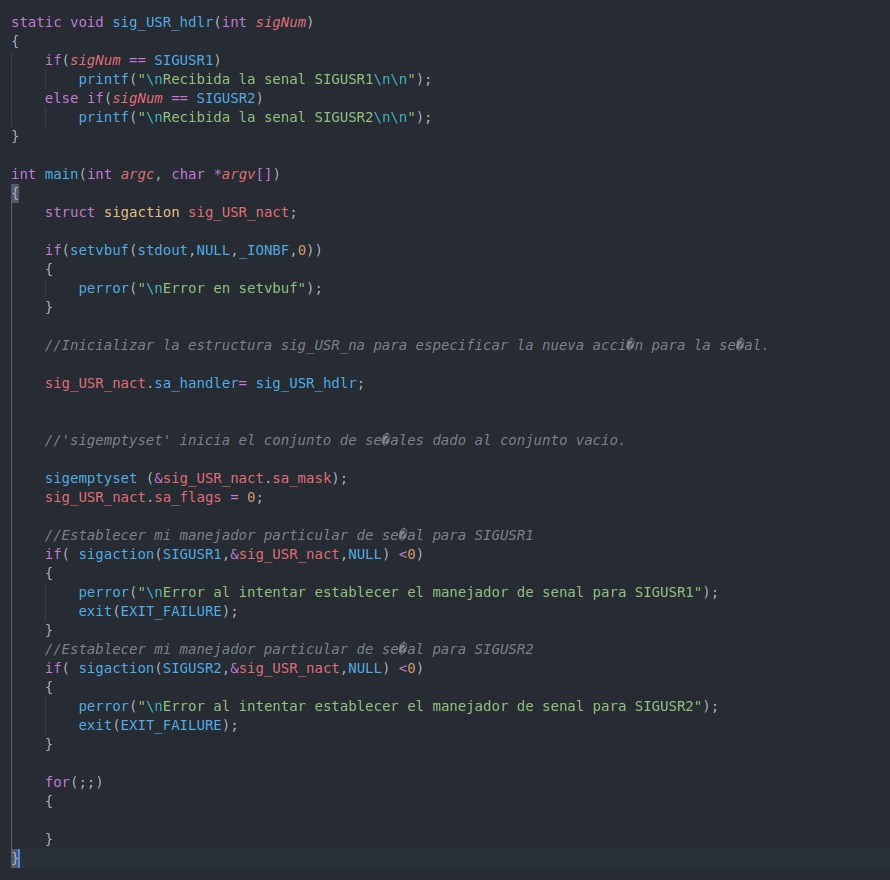
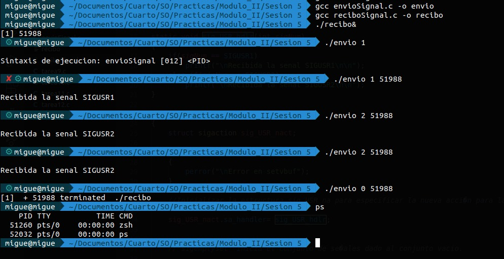
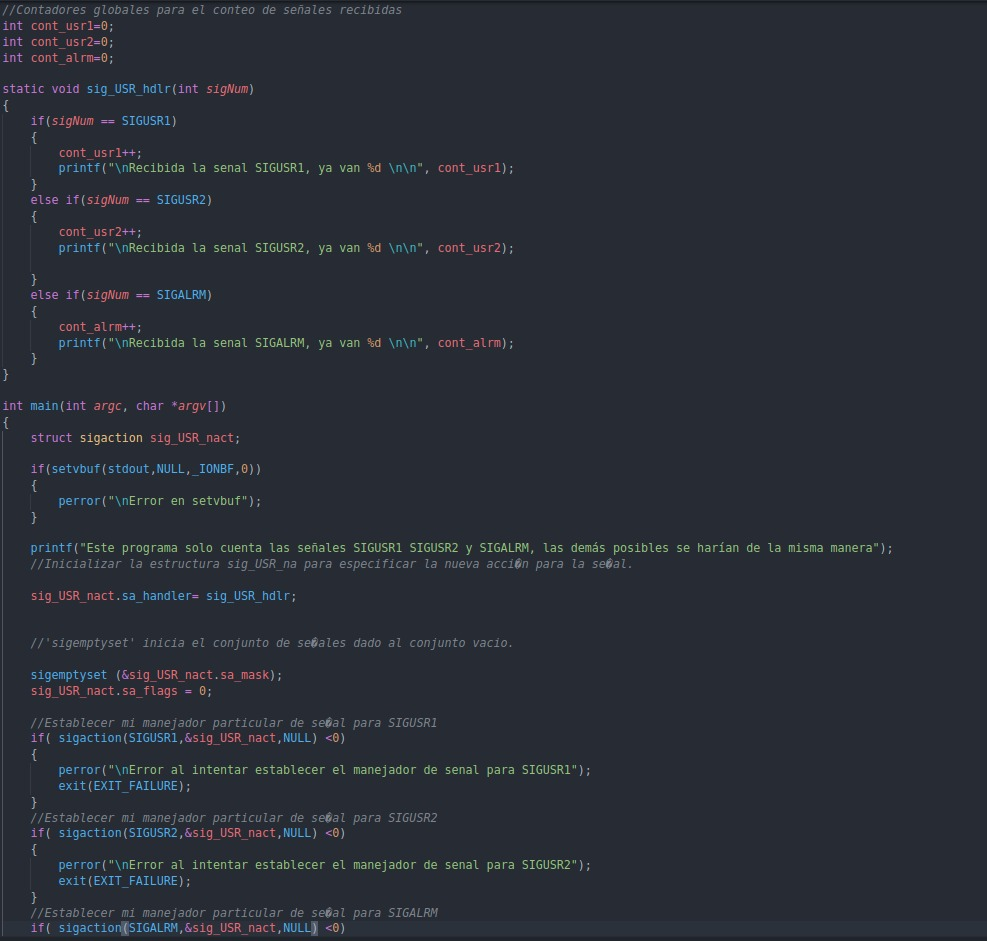
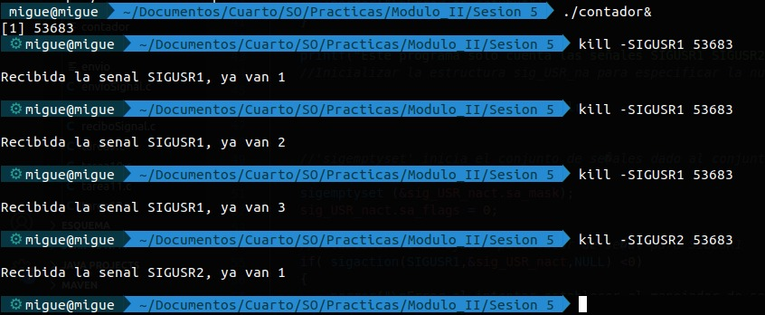

## Sesión 5

En esta práctica trabjaremos con las llamadas al sistema relacionadas con la gestión y control de señales.

Las **señales** constituyen un mecanismo básico de sincronización que utiliza el núcleo de Linux para indicar a los procesos la ocurrencia de determinados eventos síncronos/asíncronos con su ejecución. Además los procesos pueden enviarse señales para notificarse de ciertos eventos, y lo que es más importante, pueden determinar que acción realizarán como respuesta a la recepción de una señal determinada.

Un **manejador de señal** es una función definida en el programa que se invoca cuando se entrega una señal al proceso. La invocación del **manejador de señal** puede interrumpir la el flujo del control del proceso en cualquier instante. Cuando el manejador retorna, la ejecución del proceso sigue por donde fue interrumpida.

Se dice que una señal es **depositada** cuando el proceso inicia una acción en base a ella, y se dice que una señal está **pendiente** si ha sido generada pero no ha sido **depositada**. Un proceso puede **bloquear** la recepción de una o varias señales a la vez.

Las **señales bloqueadas** se almacenan en un conjuto de señales llamado **máscara de bloqueo de señales**. 

No confundir **señales bloqueadas** con **señales ignoradas**. Las **ignoradas** se desechan, las bloqueadas serán **depositadas** cuando el proceso las desenmascare.

La lista de señales y su tratamiento por defecto se puede consultar en man 7 signal o en signal.h o aquí: http://manpages.ubuntu.com/manpages/bionic/es/man7/signal.7.html

Las entradas en la columna Acción de la tabla anterior especifícan la acción por defecto para la señal usando la siguiente nomenclatura:

- **Term** : La acción por defecto es terminar el proceso.
- **Ign** : La acción por defecto es ignorar la señal.
- **Core** : La acción por defecto es terminar el proceso y realizar un volcado  de memoria.
- **Stop** : La acción por defecto es detener el proceso.
- **Cont** : La acción por defecto es que el proceso continue su ejecución si está parado. 

Las **llamadas al sistema** que podemos utilizar en Linux para trabajar con señales son principalmente: 

       #include <sys/types.h>
       #include <signal.h>

- **Kill**: Se utiliza para enviar una señal a un proceso o conjunto de procesos.

        int kill(pid_t pid, int sig);
     

    Si pid es positivo, entonces la señal sig es enviada a pid.  En este caso, se  devuelve  0
    si hay éxito, o un valor negativo si hay error.

    Si  pid  es  0,  entonces  sig se envía a cada proceso en el grupo de procesos del proceso
    actual.

    Si pid es igual a -1, entonces se envía sig a cada proceso, excepto al proceso  1  (init),
    vea más abajo.

    Si pid es menor que -1, entonces se envía sig a cada proceso en el grupo de procesos -pid.

    Si sig es 0, entonces no se envía ninguna señal pero todavía se realiza la comprobación de errores.

    Más información aquí: http://manpages.ubuntu.com/manpages/bionic/es/man2/kill.2.html

- **sigaction**: Permite establecer la acción que realizará un proceso como respuesta a la recepción de una señal. Las únicas señales que no pueden cambiar su acción por defecto son **SIGKILL** y **SIGSTOP**.

        int sigaction(int signum, const struct sigaction *act, struct sigaction *oldact);

    Si act no es nulo, la nueva acción para la señal signum se instala como act.  Si oldact no es nulo, la acción anterior se guarda en oldact.

    La estructura sigaction se define como algo parecido a

        struct sigaction
        {
            void (*sa_handler)(int);
            void (*sa_sigaction)(int, siginfo_t *, void *);
            sigset_t sa_mask;
            int sa_flags;
            void (*sa_restorer)(void);
        }

    **sa_handler** especifica la acción que se va a asociar con signum y puede ser SIG_DFL para la
    acción predeterminada, SIG_IGN para no tener en cuenta  la  señal,  o  un  puntero  a  una
    función manejadora para la señal.

    **sa_mask**  da  una  máscara  de  señales  que  deberían  bloquearse durante la ejecución del
    manejador de señal. Además, la señal que lance el manejador será bloqueada, a menos que se
    activen las opciones SA_NODEFER o SA_NOMASK.

    Para cambiar los valores a **sa_mask** se usan las siguientes funciones:

        int sigemptyset(sigset_t *set);

        int sigfillset(sigset_t *set);

        int sigaddset(sigset_t *set, int signum);

        int sigdelset(sigset_t *set, int signum);

        int sigismember(const sigset_t *set, int signum);

    Más información acerca las anteriores funciones aquí: http://manpages.ubuntu.com/manpages/precise/pt/man3/sigsetops.3.html

    **sa_flags** especifica un conjunto de opciones que modifican el comportamiento del proceso de
    manejo de señal. Se forma por la aplicación del operador de bits OR a cero o  más  de  las
    siguientes constantes:

    * SA_NOCLDSTOP
            Si signum es SIGCHLD, no se reciba notificación cuando los procesos hijos se
            paren (esto es, cuando  los  procesos  hijos  reciban  una  de  las  señales
            SIGSTOP, SIGTSTP, SIGTTIN o SIGTTOU).

    * SA_ONESHOT o SA_RESETHAND
            Restáurese  la  acción para la señal al estado predeterminado una vez que el
            manejador de señal haya sido llamado.

    * SA_ONSTACK
            Llama al manejador de señal en una pila de señales alternativa proporcionada
            por  sigaltstack(2).   Si  esta  pila  alternativa  no  está  disponible, se
            utilizará la pila por defecto.

    * SA_RESTART
            Proporciona un comportamiento compatible con la semántica de señales de  BSD
            haciendo re-ejecutables algunas llamadas al sistema entre señales.

    * SA_NOMASK o SA_NODEFER
            No se impida que se reciba la señal desde su propio manejador.

    * SA_SIGINFO
            El  manejador  de  señal  toma  3  argumentos, no uno. En este caso, se debe
            configurar sa_sigaction en lugar de sa_handler.  (El campo sa_sigaction  fue
            añadido en la versión 2.1.86 de Linux.)

    El parámetro siginfo_t para sa_sigaction es una estructura con los siguientes elementos

        siginfo_t {
            int      si_signo;  /* Número de señal */
            int      si_errno;  /* Un valor errno */
            int      si_code;   /* Código de señal */
            pid_t    si_pid;    /* ID del proceso emisor */
            uid_t    si_uid;    /* ID del usuario real del proceso emisor */
            int      si_status; /* Valor de salida o señal */
            clock_t  si_utime;  /* Tiempo de usuario consumido */
            clock_t  si_stime;  /* Tiempo de sistema consumido */
            sigval_t si_value;  /* Valor de señal */
            int      si_int;    /* señal POSIX.1b */
            void *   si_ptr;    /* señal POSIX.1b */
            void *   si_addr;   /* Dirección de memoria que ha producido el fallo */
            int      si_band;   /* Evento de conjunto */
            int      si_fd;     /* Descriptor de fichero */
        }

- **sigprocmask**: Se emplea para cambiar la lista de señales bloqueadas actualmente.

        int sigprocmask(int how, const sigset_t *set, sigset_t *oldset);

    El comportamiento de la llamada depende del valor de how, como sigue:

    * SIG_BLOCK
            El conjunto de señales bloqueadas es la  unión  del  conjunto  actual  y  el argumento set.

    * SIG_UNBLOCK
            Las  señales  en set se quitan del conjunto actual de señales bloqueadas. Es legal intentar el desbloqueo de una señal que no está bloqueada.

    * SIG_SETMASK
            El conjunto de señales bloqueadas se pone según el argumento set.

    Si oldset no es nulo, el valor anterior de la máscara de señal se guarda en oldset.

- **sigpending**: Permite el examen de señales pendientes (las que se han producido mientras estaban bloqueadas). La máscara de señal de las señales pendientes se guarda en set.

        int sigpending(sigset_t *set);

- **sigsuspend**: Reemplaza temporalmente la máscara de señal para el proceso con la dada por el argumento **mask** y luego suspende el proceso hasta que se reciba una señal.

        int sigsuspend(const sigset_t *mask);

Las  funciones  sigaction,  sigprocmask  y sigpending devuelven 0 en caso de éxito y -1 en caso de error.  La función sigsuspend siempre  devuelve  -1,  normalmente  acompañado  del error EINTR.

Se puede ampliar la información sobre las 4 últimas llamadas al sistema detalladas aquí: http://manpages.ubuntu.com/manpages/bionic/es/man2/sigaction.2.html

### Actividad 1

En este ejercicio primero lanzamos el programa que recibe señales en segundo plano, en su código hacemos uso de la llamada al sistema sigaction para definir que acción ocurrirá cuando reciba determinada señal. Para ello es necesario hacer uso de la estructura de datos sigaction.

El programa que envia señales simplemente hace uso de la llamada al sistema kill para mandarle mensajes al proceso anteriormente lanzado a través de su pid.

### Actividad 2

Para este ejercicio he cogido el programa de recibo del ejercicio anterior, y le he añadido unas variables globales a modo de contador, el ejercicio pide que se haga para todas las señales yo lo he hecho para unas cuantas. Se puede mejorar con un array en vez de usar variables globales.

