## Sesión 6

Durante esta sesión vamos a estudiar el **Control de archivos y archivos proyectados a memoria**

**Función fcntl**

La llamada al sisteme **fcntl** (file control) es una función multipropósito que, de forma general, permite consultar o ajustar las banderas de control de acceso de un descriptor, es decir, de un archivo abierto. Además, permite realizar la duplicación de descriptores de archivo y bloqueo de un archivo para acceso exclusivo.

    #include <unistd.h>
    #include <fcntl.h>

    int fcntl(int fd, int cmd);
    int fcntl(int fd, int cmd, long arg);
    int fcntl(int fd, int cmd, struct flock *lock)

El argumento **cmd** admite un rango muy diferente de operaciones a realizar sobre el descriptor de archivo que se especifica en fd. El tercer argumento que es opcional va a depender de la orden indicada. Algunas de las ordenes permitidas son las siguientes: 

- **F_GETFL**: Lee las banderas de un descriptor de fichero.
- **F_SETFL**: Ajusta o limpia las banderas de acceso que se especifican como tercer argumento. En Linux, esta orden sólo puede cambiar las banderas O_APPEND, O_NONBLOCK,O_ASYNC  y O_DIRECT.
- **F_GETFD**: Devuelve la bandera **close-on-exec** del archivo indicado. Si devuelve un 0 la bandera está desactivada, en caso contrario devuelve un valor distinto de 0. La bandera **close-on-exec** de un archivo recién abierto está desactivada por defecto.

Si la bandera **close-on-exec** está activa en un descriptor, al ejecutar la llamada **exec()** el proceso hijo no heredará este descriptor. 

- **F_SETFD**: Establece la bandera close-on-exec al valor especificado por el bit  FD_CLOEXEC  de arg.

- **F_DUPFD**: Busca el descriptor de fichero disponible de número, mayor o igual que arg, y lo  convierte en una copia de fd.  Esto es diferente en dup2(2) que usa exactamente el descriptor especificado. Los descriptores antiguo y nuevo pueden  usarse  indistintamente.  Ambos  comparten bloqueos  (''locks''),  indicadores  de  posición de ficheros y opciones o banderas(''flags''); por ejemplo, si la posición del fichero se modifica  usando  lseek  en uno de los descriptores, la posición del otro resulta modificada simultáneamente. Sin embargo, los dos descriptores no comparten la bandera close-on-exec («cerrar al ejecutar»). La bandera close-on-exec de la copia está desactivada, lo que significa que no se cerrará al ejecutar. En caso de éxito, se devuelve el nuevo descriptor.

- **F_SETLK**: Establece un cerrojo sobre un archivo. No bloquea si no tiene éxito inmediatamente.
- **F_SETLKW**: Establece un cerrojo y bloquea al proceso llamador hasta qwe se adquiere el cerrojo
- **F_GETLK**: Consulta si existe un bloqueo sobre una región del archivo.

Más información aquí: http://manpages.ubuntu.com/manpages/bionic/es/man2/fcntl.2.html

**Banderas de estado de un archivo abierto**

Uno de los usos de la función nos permite recuperar o modificar el modo de acceso y las banderas de estado (las especificadas en **open**) de un archivo abierto. Para esto usamos la bandera **F_GETFL**.

Podemos utilizar la orden **F_SETFL** para modificar alguns de las banderas de estado del archivo abierto. Estas banderas son **O_APPEND**, **O_NONBLOCK**, **O_NOATIME**,**O_ASYNC** y **O_DIRECT**. Se ignorará cualquier intento de modificar alguna otra bandera.

El uso de la función fcntl para modificar banderas de estado es útil en distintas situaciones, por ejemplo cuando el archivo no ha sido abierto por el programa llamador o cuando el descriptor de archivo se ha obtenido a través de una llamada la sistema que no es open (pipe o socket por ejemplo).

Normalmente lo que haremos será obtener las banderas con F_GETFL, operaremos con ellas a nuestro antojo y las asignaremos de nuevo con F_SETFL.

### Actividad 1

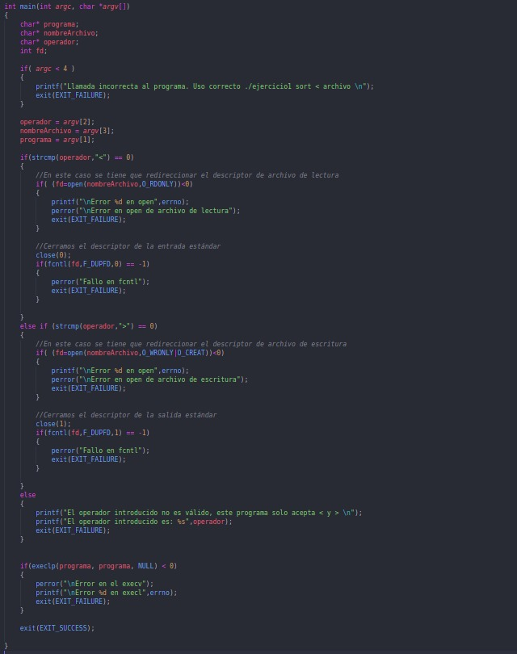
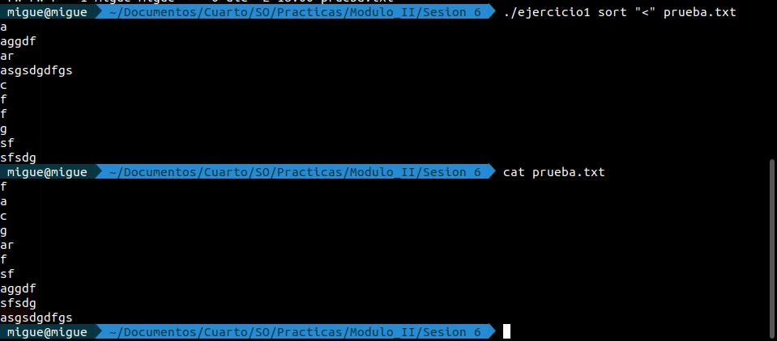

### Actividad 2

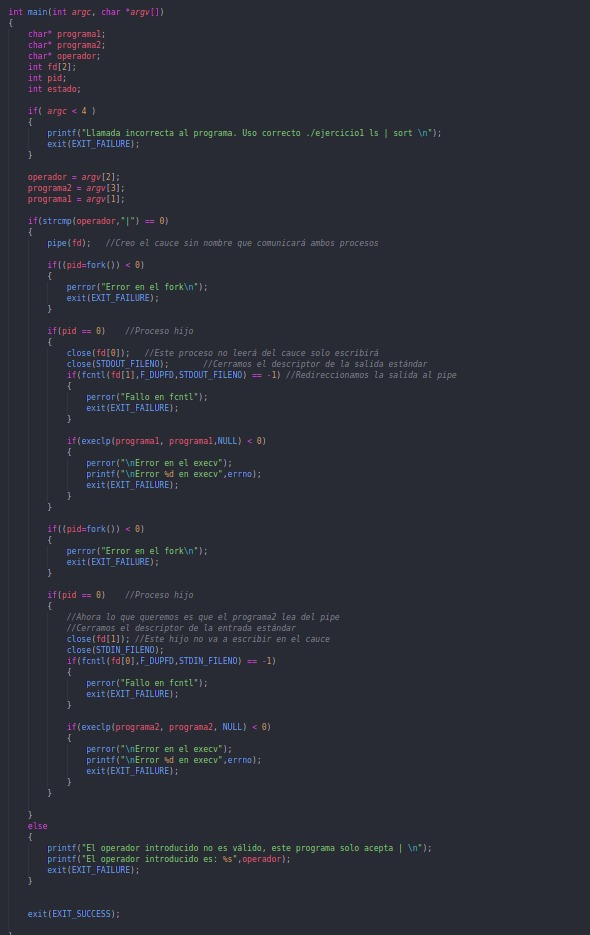
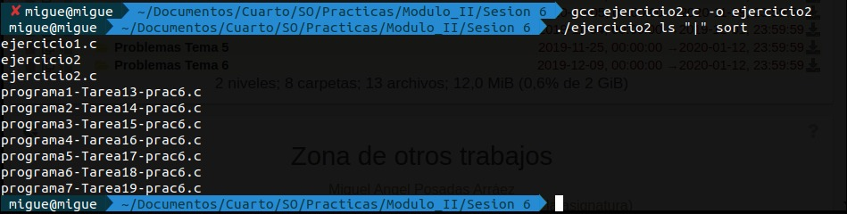

**La función fcntl y el bloqueo de archivos**

Es evidente que el acceso de varios procesos a un archivo para leer/escribir puede producir condiciones de carrera. Para evitarlas debemos sincronizar las acciones de éstos. Si bien podríamos pensar en utilizar semáforos, el uso de cerrojos de archivos es más corriente debido a que el kernel asocia automáticamente los cerrojos con archivos. Tenermos dos APIs para manejar cerrojos de archivos: 

- **flock()** que utiliza un cerrono para bloquear el archivo completo.
- **fcntl()** que utiliza cerrojos para bloquear regiones de un archivo.

El método general para utilizarlos tienen los siguientes pasos:

    1. Posicionar un cerrojo sobre el archivo.
    2. Realizar las entradas/salidas sobre el archivo
    3. Desbloquear el archivo de forma que otro proceso pueda bloquearlo

Como consideración inicial y dado que la biblioteca stdio utiliza búfering en espacio de usuario, debemos tener cuidado cuando utilizamos funciones de stdio con las técnicas que vamos a describir a continuación. El problema proviene de que el búfer de entrada puede llenarse antes de situar un cerrojo, o un búfer de salida puede limpiarse despúes de eliminar un cerrojo. Para evitar este problema podemos tener en cuenta lo siguiente:

    1. Realizar las E/S utilizando read/write y llamadas relaacionadas en lugar de utilizar la biblioteca stdio.
    2. Limpiar el flujo (stream) stdio inmediatamente despúes de situar un cerrojo sobre un archivo, y limpiarlo una vez inmediateamente antes de liberar el cerrojo.
    3. Si bien a coste de eficiencia, deshabilitar el búfering de stdio con setbuf() o similar.

Debemos diferenciar entre dos tipos de bloqueos:

- **Bloqueo consultivo:** Esto significa que un proceso puede ignorar un cerrojo situado por otro proceso. Para que este bloqueo funcione, cada proceso que accede a un archivo debe cooperar situando un cerrojo antes de realizar una operación E/S.
- **Bloqueo obligatorio:** Se fuerza a que un proceso que realiza E/S respete el cerrojo impuesto por otro proceso.

**Bloqueo de registros con fcntl**

Como hemos indicado, fcntl() puede situar un cerrojo en cualquier parte de un archivo, desde un único byte hasta el archivo completo. Esta forma de bloqueo se denomina normalmente **bloqueo de registros**.

Para utilizar **fcntl()** en un bloqueo de archivos necesitamos utilzar una estructura **flock** que define el cerrojo.

    struct flock {
        ...
        short l_type;    /* Tipo de bloqueo: F_RDLCK (cerrojo de lectura), F_WRLCK (cerrojo escritura), F_UNLCK (eliminar un cerrojo) */
        short l_whence;  /* Cómo interpretar l_start:
                            SEEK_SET, SEEK_CUR, SEEK_END */
        off_t l_start;   /* Dirección de inicio del bloqueo */
        off_t l_len;     /* Número de bytes a bloquear */
        pid_t l_pid;     /* PID del proceso que bloquea nuestro candado
                            (sólo F_GETLK) */
        ...
    };

Más información aquí: http://manpages.ubuntu.com/manpages/bionic/es/man2/fcntl.2.html

Si queremos situar un cerrojo de lectura en un archivo, el archivo debe abrirse en modo lectura. De modo similar, si el cerrojo es de escritura, el archivo se abrirá en modo escritura. Para ambos tipos de cerrojos, el archivo debe abrirse en modo lectura/escritura. Si usamos un modo incompatible con el modo de apertura del archivo obtendremos el error **EBADF**.

El conjunto de campos l_whence, l_strart y l_len especifican el rango de bytes que deseamos bloquear

Para bloquear el archivo entero podemos especificar l_whence como SEEK_SET y l_start y l_len a 0.

Las 3 ordenes que admite fcntl relativas al bloqueo de procesos son las siguientes: 

- **F_SETLK:** Adquiere (l_type = F_REDLCK ó F_WRLCK) o libera (l_type = F_UNLCK) un cerrojo sobre los bytes especificados por flockstr. Si hay un proceso que tiene un cerrojo incompatible sobre alguna parte de la región a bloquear, la llamada fcntl falla con error EAGAIN.
- **F_SETLKW:** Igual que la anterior, aunque si el proceso mantiene un cerrojo incompatible sobre una parte de la región a bloquear, el llamador se bloqueará hasta que su bloqueo sobre el cerrojo tenga éxito. Si estamos manejando señales y no hemos especificado SA_RESTART, una operación F_SETLKW puede verse interrumpida, es decir, falla con error EINTR. Esto se puede utilizar para establecer un temporizador asociado a la solicitud de bloqueo a través de **alarm()**  o **setitimer()**.
- **F_GETLCK:** Comprueba si es posible adquirir un cerrojo especificado en **flockstr**, pero realmente no lo adquiere. El campo l_type debe ser F_RDLCK o F_WRLCK. En este caso la estructura **flockstr** se trata como valor resultado. Al retornar de la llamada, la estructura contiene información sobre si podemos establecer o no el bloqueo. Si el bloqueo se permite, el campo l_type contiene F_UNLCK, y los restantes campos no se tocan. Si hay uno o más bloqueos incompatibles sobre la región, la estructura retorna información sobre uno de los bloqueos, sin determinar cual, incluyendo su tipo (l_type) y rango de bytes(l_start, l_len, l_whence siempre se retorna como SEEK_SET) y el identificador del proceso que lo tiene (l_pid).

Tenemos que observar los siguientes puntos en la adquisición/liberación de un cerrojo:

- Desbloquear una región siempre tiene éxito. (Si no hay cerrojo y desbloqueamos no da error).
- En cualquier instante, un proceso solo puede tener un tipo de cerrojo sobre una región concreta de un archivo. (Si es del mismo tipo no ocurre nada, si ponemos otro de otro tipo se sustituye el antiguo por el nuevo, debemos contemplar la posibilidad de que al hacer esto F_SETLK devuelva error o F_SETLKW se bloquee)
- Un proceso nunca puede bloquearse el mismo en una región de archivo.
- Situar un cerrojo de modo diferente en medio de un cerrojo que ya tenemos produce 3 cerrojos (ver foto)

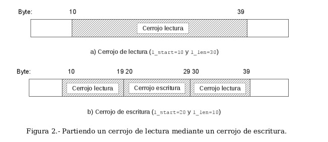

Respecto a la inanición que puede producirse cuando un proceso intente realizar un cerrojo de escritura cuando otros procesos intentan establecer cerrojos de lectura:

- El orden en el que se sirven las solicitudes de cerrojos no está determinado. Si varios procesos esperan para obtener un cerrojo, el orden en el que se satisfacen las peticiones depende de como se planifican los procesos.
- Los escritores no tienen prioridad sobre los lectores, ni viceversa.

Al manejar el bloqueo de registros con fcntl() debemos tener en cuenta las siguientes consideraciones relativas a la semántica de herencia y liberación:

- Los cerrojos de registros no son heredados con fork() por el hijo.
- Los bloqueos se mantienen a través de exec()
- Todos los hilos de una tarea comparten los mismo bloqueos.
- Los cerrojos de registros están asociados tanto a procesos como a inodos. Una consecuencia esperadad de esta asociación es que cuando un proceso termina, todos los cerrojos que poseía son liberados. Menos esperado es que cuando un proceso cierra un descriptor, se liberan todos los cerrojos que ese proceso tuviera sobre ese archivo.

Los elementos vistos hasta ahora sobre cerrojos se refieren a bloqueos consultivos. Como comentamos, esto significa que un proceso es libre de ignorar el uso de fcntl() y realizar directamente la operación de E/S sobre el archivo. Cuando usamos un bloqueo consultivo se deja al diseñador de la aplicación que:

- Ajuste la propiedad y permisos adecuados sobre el archivo, para evitar que los procesos no cooperantes realicen operaciones de E/S sobre él.
- Se asegure que los procesos que componen la aplicación cooperan para obtener el cerrojo apropiado sobre el archivo antes de realizar la E/S.

Para usar el bloqueo obligatorio debemos habilitarlo en el sistema de archivos (Ver guión de prácticas página 146).

**El archivo /proc/locks**

En Linux, podemos ver los cerrojos actualmente en uso en el sistema examinando el archivo específico /proc/locks.

Este archivo tiene información de los cerrojos creados tanto por flock como por fcntl(). Cada línea nos muestra información de un cerrojo y tiene 8 campos:

- Número ordinal de l cerrojo dentro del conjunto de todos los cerrojos del archivo.
- Tipo de cerrojo, donde POSIX indica que el cerrojo se creó con fcntl() y FLOCK el que se creó con flock()
- Modo de cerrojo: Consultivo (ADVISORY) o obligatorio (MANDATORY)
- El tipo de cerrojo ya sea Write o Read
- El pid del proceso
- 3 números separados por ":" que identifican el archivo sobre el que se mantiene el cerrojo: El número principal y secundario del dispositivo donde reside el sistema de archivos que contiene el archivo, seguido del número de inodo del archivo.
- El byte de inicio del bloqueo. Para flock siempre es 0
- El byte final de bloquo. Donde EOF significa que el cerrojo se extiende hasta el final del archivo. Para flock esta columna siempre es EOF

**Ejecutar una única instancia de un programa**

Algunos programas, y en especial, algunos demonios, deben asegurarse de que solo se ejecuta una instancia del mismo en un instante dado. El método es que un archivo cree un archivo en un directorio estándar y establezca un cerrojo de escritura sobre el.

El programa tiene el bloqueo del archivo durante toda su ejecución y lo libera justo antes de terminar. Si se inicia otra instancia del programa, fallará al obtener el cerrojo de escritura. Por tanto supone que existe otra instancia del programa ejecutándose y termina. Una ubicación usual para tales archivos de bloqueos es /var/run.

Por convención, los demonios escriben su propio identificador en el archivo de bloquo, y en ocasiones el archivo se nombre con la extensión .pid.

### Actividad 3

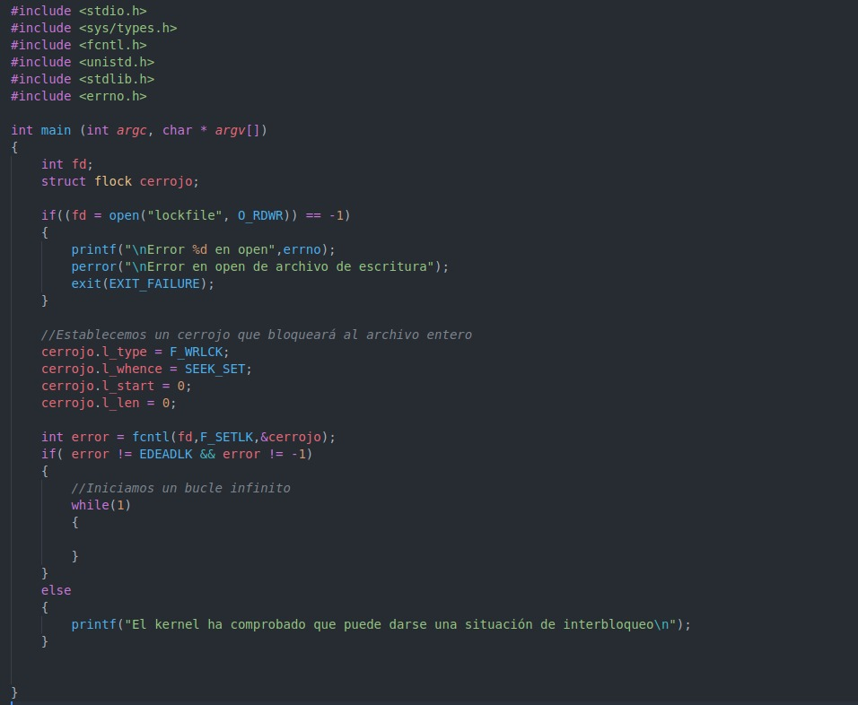
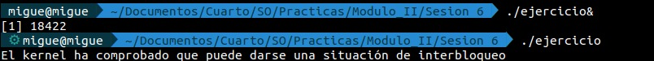

### Actividad 4

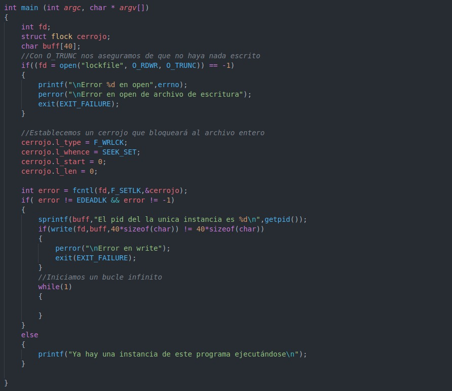
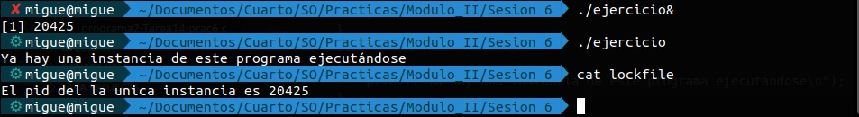

**Archivos proyectados en memoria con mmap**

Un archivo proyectado en memoria es una técnica que utilizan los sistemas operativos actuales para acceder a archivos. En lugar de una lectura "tradicional" lo que se hace es crear una nueva región de memoria en eñ espacio de direcciones del proceso del tamaño de la zona a acceder del archivo (una parte o todo el archivo) y cargar en ella el contenido de esa parte del archivo. Las páginas de la proyección son (automáticamente) cargadas del archivo cuando sean necesarias.

La función **mmap()** proyecta bien un archivo bien un objeto memoria compartida en el espacio de direcciones del proceso. Podemos usarla para tres propósitos:

- Con un archivo regular para suministrar E/S proyectadas en memoria (lo que estudiaremos en este apartado)
- Con archivos especiales para suministrar proyecciones anónimas
- Con **shm_open** para compartir memoria entre procesos no relacionados.

        #include <sys/mman.h>

        caddr_t mmap(void *start, size_t length, int prot , int flags, int fd, off_t offset);

El primer argumento de la función, **address** especifica la dirección de inicio dentro del proceso donde debe proyectarse el descriptor. **Normalmente especificaremos nulo, lo que le indica al kernel que elija la dirección de inicio** (en este caso la función de vuelve la dirección asignada). **len** es la cantidad de bytes a proyectar desde el comienzo del archivo desplazado un determinado **offset**. **fd** es el descriptor de archivo a proyectar que una vez proyectado podemos cerrar.

**address** y **offset** deberán estar alineados al límite de páginas, es decir deben ser enteros múltiples del tamaño de página. Si el parámetro **len** no está alineado a página, la proyección se redondea por exceso hasta completar la última página. Los bytes añadidos se rellenan a 0 y cualquier modificación de esos bytes no afectará al almacén subyaccente.

El tipo de protección viene dado por la máscara de bits **prot** y para ello usamos las siguientes constantes:

- PROT_READ: Los datos se pueden leer.
- PROT_WRITE: Los datos se pueden escribir.
- PROT_EXEC: Podemos ejecutar los datos.
- PROT_NONE: No podemos acceder a los datos.

Los valores del argumento **flags** son los siguientes:

- MAP_PRIVATE: Los modificadores de los datos proyectados por el proceso son visibles solo para ese proceso y no modifican el objeto subyacente de la proyección. El uso principal es que múltiples procesos compartan códigos/datos de un ejecutable/biblioteca, de forma que las modificaciones que realicen no se guarden en el archivo.
- MAP_SHARED: Las modificaciones de los datos de la proyección son visibles a todos los procesos que la compartan y estos cambios modifican el objeto subyacente. Sirve para hacer E/S proyectadas a memoria o para compartir memoria entre procesos.
- MAP_FIXED: Instruye a mmap() que la dirección address es un requisito, no un consejo. (Ampliar en el enlace de abajo)
- MAP_ANONYMOUS
- MAP_LOCKED
- MAP_NORESERVE
- MAP_POPULATE
- MAP_UNITIALIZED

Más información aquí: http://manpages.ubuntu.com/manpages/bionic/es/man2/mmap.2.html

Los pasos básicos para realizar la proyección son los siguientes:

- Obtener el descriptor de archivo con los permisos correspondientes (normalmente usando open)
- Pasar el descriptor de archivo a la llamada map

Para eliminar una proyección utilizamos:

    #include <sys/mman.h>

    int munmap(void *start, size_t length);

El argumento **address** es la dirección que retorno la llamada **mmap()** para esa proyección, y **len** es el tamaño de la región mapeada. Una vez desmapeada, cualquier referencia a la proyección generará la señal **SIGSEGV**. Si una región se declaró como MAP_PRIVATE los cambios que se realizaron serán descartados.

Durante la proyección, el kernel mantiene sincronizada la región mapeada con el archivo suponiendo que se declaró MAP_SHARED. Es decir, si modificamos un dato de la región mapeada, el kernel actualizará en algún instante posterior el archivo. Pero si deseamos que la sincronización sea inmediata debemos utilizar **msync()**

Ventajas de utilizar el mecanismo de proyección de archivos:

- Desde el punto de vista del programador, simplificamos código ya que tras recibir el archivo y establecer el mapeo, no es necesario utilizar **write o read**
- Es más eficiente sobre todo para archivos grandes. Además una vez creada la proyección no es necesario hacer llamadas al sistema extras.
- Cuando varios procesos proyectan un mismo objeto en memoria, solo hay una copia de él compartida por todos ellos.
- La búsqueda de datos en la proyección involucra la manipulación de punteros, por lo que no hay necesidad de utilizar lseek.

Es necesario tener una serie de consideraciones:

- El mapeo de un archivo debe encajar en el espacio de direcciones de un proceso. Con 32 bits, si hacemos numerosos mapeos de diferentes tamaños, fragmentamos el espacio y podemos hacer que sea dificil encontrar una región libre continua.
- La atomicidad de las operaciones es diferente. En una proyección la atomicidad de una operación viene determinada por la atomicidad de la memoria.
- La visibilidad de los cambios es diferente. Si dos procesos comparten una proyección, la modificación de datos de la proyección por parte de un proceso es instantáneamente vista por el otro proceso.
- La diferencia entre el tamaño del archivo proyectado y el número de páginas utilizadas en la proyección es espacio "desperdiciado".
- No todos los archivos pueden ser proyectados.

Otras funciones relacionadas con la protección de archivos son las siguientes:

    mremap() //Extiende una proyección existente
    mprotect() //Cambia la protección de una proyección
    madvise() //Establece consejos sobre como manejar una zona de memoria
    remap_file_pages() //Permite crear mapeos no lineales es decir mapeos donde las páginas de un archivo aparecen en un orden diferente dentro de la memoria contigua.
    mlock() // Permite bloquear (anclar) páginas en memoria
    mincore() //informa sobre las páginas que están actualmente en RAM

**Compartición de memoria**

Una forma de compartir memoria entre un proceso padre y un hijo es invcocar mmap() con MAP_SHARED en el padre antes de invocar a **fork()**. El estándar POSIX garantiza que la proyección creada por el padre se mantiene en el hijo. Es más, los cambios realizados por un proceso son visibles en el otro.

**Proyecciones anónimas**

Una proyección anónima es similar a una proyección de archivo salvo que no existe el correspondiente archivo de respaldo. En su lugar las páginas de la proyección son inicializadas a cero.

Propositos de los diferentes tipos de proyecciones en memoria.

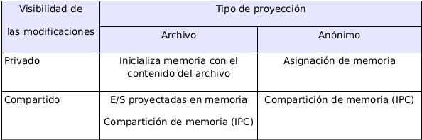

Las proyecciones anonimas se crean con MAP_ANON y fd = -1 (está en desuso)

**Tamaño de la proyección y del archivo proyectado**

En muchos casos, el tamaño del mapeo es múltiplo del tamaño de página, y cae completamente dentro de los límites del archivo proyectado. En este apartado estudiaremos que ocurre cuando no se cumplen dichas condiciones.

(VER EXPLICACIÓN EN PÁGINA 158 DEL GUIÓN)

### Actividad 5

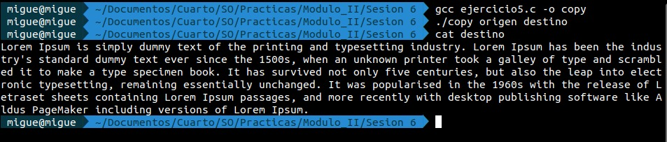